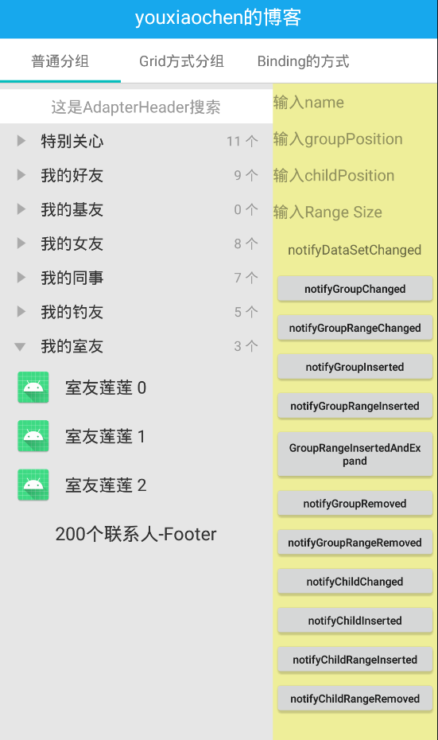
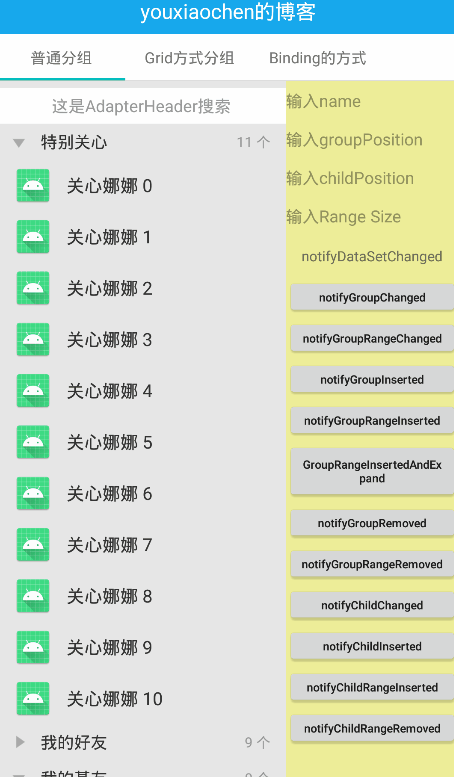

# ExpandableRecyclerView, 完全不限制RecyclerView
#### ExpandableRecyclerView by RecyclerView logic as ExpandableListView, 核心类ExpandableConnector, GroupMetadata,PositionMetadata, GroupViewHolder, ChildViewHolder, GroupInfo, ChildInfo
#### 采用ExpandableListView原理并加入RecyclerView机制, 增加PositionMetadata缓存机制, 支持Header, Footer, ConcatAdapter

#### 使用
```
allprojects {
    repositories {
        ...
        maven { url 'https://jitpack.io' }
    }  
}

dependencies {
	implementation 'com.github.youxiaochen:expandable-recyclerview:1.0.0'
}
```

#### ExpandableRecyclerView相关方法

| ExpandableRecyclerView 常用方法                                              | 说明                                                 |
|--------------------------------------------------------------------------|----------------------------------------------------|
| expandGroup(int), isGroupExpanded(int)                                   | 组相关操作 展开,  是否展开                                    |
| collapseGroup(int)                                                       | 组相关操作 叠起, 是否叠起                                     |
| setAdapter(ExpandableAdapter...)                                         | 适配器,支持ConcatAdapter                                |
| findGroupInfoByIndex(int),findGroupInfoByIndex(int,GroupInfo)            | 通过groupPos查找相GroupInfo, GroupInfo查找复用              |
| findChildInfoByIndex(int,int),findChildInfoByIndex(int,int,ChildInfo)    | 通过groupPos,childPos查找ChildInfo, ChildInfo复用        |
| findGroupInfoByPosition(int), findChildInfoByPosition(int)               | 通过Adapter position查找相关信息,可以是ConcatAdapter 支持info复用 |
| findGroupInfoByBindingPosition(int), findChildInfoByBindingPosition(int) | 通过ExpandableAdapter中的位置查找相关信息  ,info复用             |
| static isGroupViewType(int)                                              | viewType类型是否为组                                     |
| getCurrentTotalChildCount()                                              | 获取展开的所有Child数量                                     |
| isGroupTypeByPosition, isGroupTypeByBindingPosition                      | viewType类型是否为组                                     |
| getHeaderCount(), getFooterCount                                         | 获取Header,Footer数量                                  |

#### ExpandableAdapter相关方法

| ExpandableAdapter 常用方法                           | 说明                                               |
|--------------------------------------------------|--------------------------------------------------|
| getGroupCount, getChildCount                     | adapter count                                    |
| getGroupViewType , getChildViewType              | group, child viewType                            |
| onCreateGroupViewHolder, onCreateChildViewHolder | group,child create ViewHolder                    |
| onBindGroupViewHolder, onBindChildViewHolder     | 支持 List<Object> payloads                         |
| getGroupItemId, getChildItemId ,hasStableIds     | setHasTableIds                                   |
| groupCanClick                                    | 组不可点击时全部展开,                                      |
| saveExpandableState                              | 是否保存Expandable状态,关联onSaveStateInstance           |
| getPositionPoolSize                              | PositionMetadata缓存数量                             |
| onGroupStateChanged                              | 展开或者叠时回调                                         |
| onGroupViewRecycled,  onChildViewRecycled        | Group,child ViewHolder recycler                  |
| onGroupViewAttachedToWindow,  detached           | Group AttachedToWindow,  detached                |
| onChildViewAttachedToWindow,  detached           | Child AttachedToWindow,  detached                |
| onAttachedToExpandableRecyclerView,  detached    | AttachedToExpandableRecyclerView, detached       |
| notifyDataSetChanged                             | adapter 刷新                                       |
| notifyGroupChanged, notifyGroupRangeChanged...   | 刷新Group是否连带刷新Child     RangeChanged              |
| notifyGroupInserted,  notifyGroupRangeInserted   | Group insert, 顺insert时Child是否展开                  |
| notifyGroupRemoved,  notifyGroupRangeRemoved     | Group remove      rangeRemoved                   |
| notifyChildChanged,  notifyChildRangeChanged     | Child 刷新     RangeChanged                        |
| notifyChildInserted, notifyChildRangeInserted... | Child inserted    RangeInserted                  |
| notifyChildRemoved,  notifyChildRangeRemoved     | child remove      RangeRemoved                   |
| registerAdapterDataObserver,unRegister...        | ExpandableAdapter注册与取消 观察者, 用于扩展(如StickyAdapter) |

#### 博客地址  侍...


#### 使用及扩展可参考Demo中的extern包
#### [示例包下载](image-and-apk/expandablerecyclerview-test.apk)



### E-mail-QQ: 86207610@qq.com  W: 86207610   Welcome to star